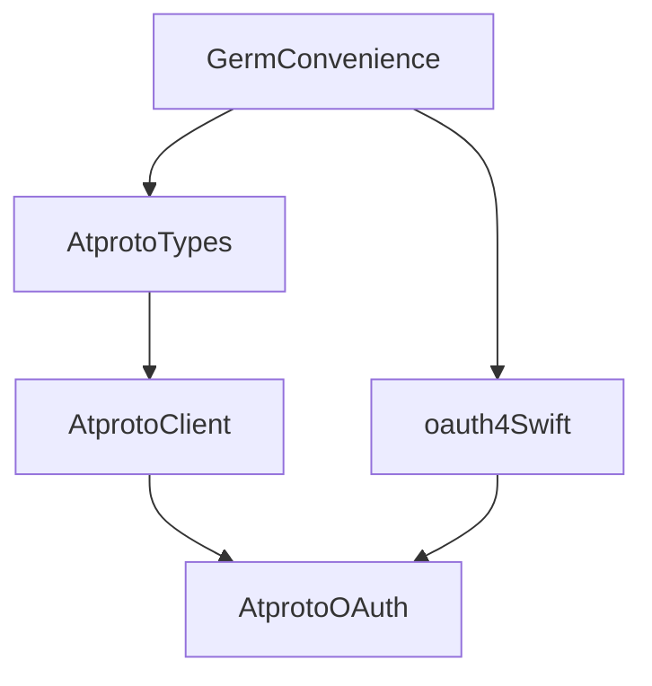

Dev plan for this:

./LocalPackages will be spun out into their own repos


# Package Composition



AtprotoOAuth package is the composition of several packages which can be used
independently. It is primarily the intersection of an AtprotoClient and an OAuth
2.1 package.

## AtprotoClient
Defines interfaces for commuincating with atproto services, which accepts injected `AtprotoSession` that can make authenticated requests to OAuth protected resources

### AtprotoTypes
Defines atproto types, primarily but not exclusively from lexicon.
We intend to codegen the lexicon types

## oauth4Swift
Paralleling oauth4web, contains low-level components from which a full OAuth
client can be built

## GermConvenience
Both branches depend on some shared helpers which we park in a GermConvenience
repository

# AtprotoOAuth
AtprotoOAuthClient is a non-stateful object (struct) that can spawn stateful
AtprotoOAuthSessions (actors) after initiating a user authentication.

Sessions have a one-way lifetime. They internally refresh tokens (serializing
the refresh request) but once permaenently expired, the app should request a new
session object from the AtprotoOAuthClient.

## Persistence
AtprotoOAuthSessions can be persisted with its Codable Archive, and restored
from that archive. The Archive contains a DPoP private key, and should be
handled with the appropriate security for cryptographic secrets.
It is recommended that the entire archive be stored en bloc to remove the risk
of the components falling out of sync (e.g. one component deleted but the other
lingers), but the archive can be deconstructed if the client wishes
to store the keys separately.

The restore returns an async stream (buffering one element) of the session's
archive, so that a consumer of the stream can save updates. This stream is not
available later.

The session does have an API for a similiar stream for the app's mutable state
(hence, not including the DPoP key) for UI updates


# Demo App
The repository contains a demo app under ./DemoApp.

# Linting and Practices
The repo has a .editorconfig and .swift-format setup. We use both swift
formatter and linter:
```
swift format . -ri && swift format lint . -r
```
