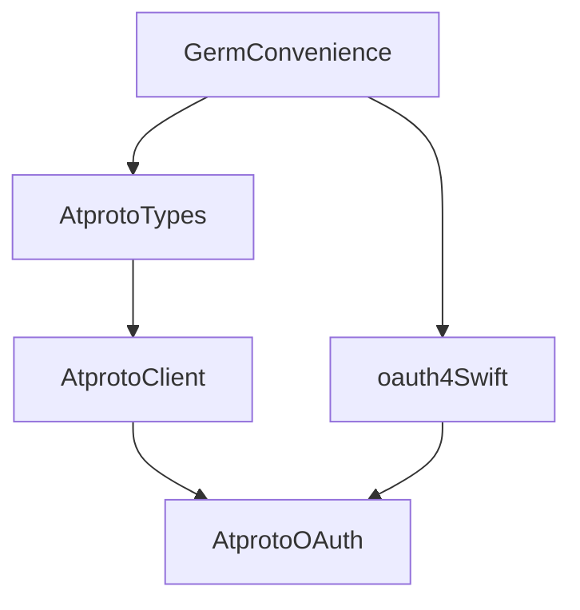

Dev plan for this:

./LocalPackages will be spun out into their own repos


# Package Composition



AtprotoOAuth package is the composition of several packages which can be used
independently. It is primarily the intersection of an AtprotoClient and an OAuth
2.1 package.

# AtprotoClient
Defines interfaces for commuincating with atproto services, which accepts injected `AtprotoSession` that can make authenticated requests to OAuth protected resources

## AtprotoTypes
Defines atproto types, primarily but not exclusively from lexicon.
We intend to codegen the lexicon types

# oauth4Swift
Paralleling oauth4web, contains low-level components from which a full OAuth
client can be built

### GermConvenience
Both branches depend on some shared helpers which we park in a GermConvenience
repository

# Demo App
The repository contains a demo app under ./DemoApp. 

# Linting and Practices
The repo has a .editorconfig and .swift-format setup. We use both swift
formatter and linter:
```
swift format . -ri && swift format lint . -r
```
